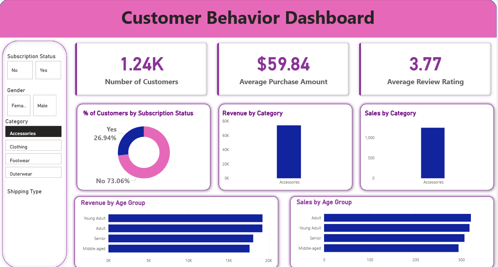

# Customer Shopping Behavior Analysis

## 📌 Project Overview
This project analyzes customer shopping behavior using transactional data from **3,900 purchases** across multiple product categories.  
The objective is to uncover insights into **spending patterns, customer segments, product preferences, discounts, and subscription behavior** to support data-driven business decisions.

---

## 📊 Dataset Summary
- **Rows:** 3,900  
- **Columns:** 18  

### Key Features
- **Customer Demographics:** Age, Gender, Location, Subscription Status  
- **Purchase Details:** Item Purchased, Category, Purchase Amount, Season, Size, Color  
- **Shopping Behavior:**  
  - Discount Applied  
  - Promo Code Used  
  - Previous Purchases  
  - Purchase Frequency  
  - Review Rating  
  - Shipping Type  

### Data Quality
- **Missing Values:** 37 missing entries in the `Review Rating` column  
- Missing ratings were imputed using the **median rating per product category**

---

## 🧹 Data Preparation & Feature Engineering (Python)
The dataset was cleaned and prepared using **Python (pandas)**:

- Loaded and explored data using `df.info()` and `df.describe()`
- Standardized column names to **snake_case**
- Handled missing values in `review_rating`
- Created new features:
  - `age_group` (binned customer ages)
  - `purchase_frequency_days`
- Checked redundancy between `discount_applied` and `promo_code_used`
  - Dropped `promo_code_used`
- Loaded the cleaned dataset into **PostgreSQL** for SQL-based analysis

---

## 🗄️ SQL Analysis (PostgreSQL)
Business-focused queries were executed to answer key questions:

1. **Revenue by Gender**
2. **High-Spending Discount Users**
3. **Top 5 Products by Average Rating**
4. **Shipping Type Comparison** (Standard vs. Express)
5. **Subscribers vs. Non-Subscribers** (average spend & total revenue)
6. **Discount-Dependent Products**
7. **Customer Segmentation**
   - New
   - Returning
   - Loyal
8. **Top 3 Products per Category**
9. **Repeat Buyers vs. Subscription Status**
10. **Revenue Contribution by Age Group**

---

## 📈 Key Insights
- Male customers generated higher total revenue than female customers
- Express shipping users had slightly higher average purchase amounts
- Subscription users showed strong revenue contribution despite smaller user count
- A large portion of customers fall into the **Loyal** segment
- Certain products rely heavily on discounts to drive sales
- Young Adult and Middle-aged customers contributed the highest revenue

---

## 📊 Dashboard (Power BI)
An **interactive Power BI dashboard** was created to visualize:
- Customer count and average purchase amount
- Subscription distribution
- Revenue and sales by category
- Revenue and sales by age group
- Shipping type and customer filters

  
   
  <em>Figure: Power BI dashboard showing customer distribution, revenue, and purchase behavior</em>

---

## 💡 Business Recommendations
- **Boost Subscriptions** with exclusive benefits
- **Reward Loyal Customers** through loyalty programs
- **Review Discount Strategy** to balance sales and margins
- **Highlight Top-Rated & Best-Selling Products**
- **Target High-Revenue Age Groups** and express-shipping users in campaigns

---

## 🛠️ Tools & Technologies
- **Python:** pandas, NumPy  
- **Database:** PostgreSQL  
- **Visualization:** Power BI  
- **Analysis:** SQL, Exploratory Data Analysis (EDA)

---

## 📂 Project Structure
├── data/
│ └── customer_shopping_data.csv
├── notebooks/
│ └── eda_and_cleaning.ipynb
├── sql/
│ └── analysis_queries.sql
├── dashboard/
│ └── power_bi_dashboard.pbix
└── README.md

---

## 🚀 How to Run
1. Clone the repository  
2. Install Python dependencies  
3. Run the EDA notebook to clean and prepare data  
4. Load cleaned data into PostgreSQL  
5. Execute SQL queries for analysis  
6. Open the Power BI dashboard for visualization

---

## 📌 Author
Prafulla Bharate
